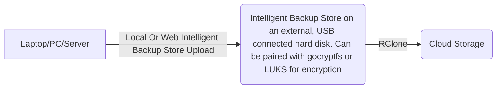

# intelligent-backup-store-app

A hash-based store for storing all your content, but without storing duplicates.

intelligent-backup-store uses SHA-512 hashing to store all your content exactly once - so no matter how many times you copy-and-pasted that photo or video across your filesystem, intelligent-backup-store will keep a record of every place that you stored it, but only store the raw file once. It also stores versions of backups across the disk.

Note: Hash collisions are very, very rare with SHA-512 hashing, but are still possible. For files that must never be lost you should either check the contents of the uploaded file (we won't write over it after we first write it), or you should devise another backup strategy for these files.

Upload can be done locally or over HTTP. To upload over HTTP, Start the web server to start the upload server, and the web application to view your records of files in a web browser.

If you would like to make a client for the uploader, you can! The messages are serialised with protocol buffers. You can find the .proto files in this repository and and generate code with your language of choice. Search for Google Protocol Buffers guide for help on this.

All requests should be made with `application/octet-stream` Content-Type.

This is the structure of the upload process. The proper nouns are protobuf messages defined in the .proto files.

1. Client posts an OpenTxRequest, with a list of file names and SHA-512 hashes that need backing up
2. Server responds with an OpenTxResponse, with a `revision` ID string, and the list of files the client needs to send. Files that were in the original request but not in this response are already in the server, and adding the records of these files are
3. Client sends lots of separate HTTP requests with FileProto messages for all the files the server needs.
4. When finished sending files (and receiving responses for all previous HTTP calls), the client should call the Commit endpoint.

## How should I use this?

A good starting point for how to take backups is to use the 3-2-1 strategy:

- 3 copies of the data.
- 2 different types of media. E.g. Hard disk, Cloud Storage.
- 1 copy off-site. In a separate location to protect against fire, theft, etc.

Here is an example. We have a laptop that needs backing up. We have an external, USB-connected hard disk at our disposal. And we also use a cloud storage for backup.

We use `intelligent-backup-store-app` to backup our laptop contents to the external hard disk. We then use the [RClone](https://rclone.org/) program to copy the contents of the store to a cloud storage. We can also, optionally, use the [gocryptfs](https://github.com/rfjakob/gocryptfs) program to create an encrypted folder, and put the store in there. Then, when backing up to the cloud storage, instead of the store (plaintext) directory, we can instead upload the encrypted vault/ciphertext directory.

The most important (and most neglected) part of your backup process is to test backups. To do this:

1. Open a new user account on your computer to simulating starting from scratch (i.e. what would happen if you lost your PC)
2. Use the [RClone Mount](https://rclone.org/commands/rclone_mount/) functionality to mount the remote storage
3. [If you used gocryptfs to create an encrypted directory] Mount the plaintext directory, from the RClone-mounted directory.
4. Now run the store application with the `start-webapp` command.
5. Navigate to the web server, open some files and verify the contents they give match what you expect.

## Design Philosophy

1. Disk space is cheap nowadays, but not unlimited. Some people are using pay-per-GB space. It should be possible to delete old backups, without the overhead of storing the same file twice.
2. Data should remain recoverable after this program has gone. Therefore information should be stored in text formats, and any additional programs for recovery should be common and easy to find.
